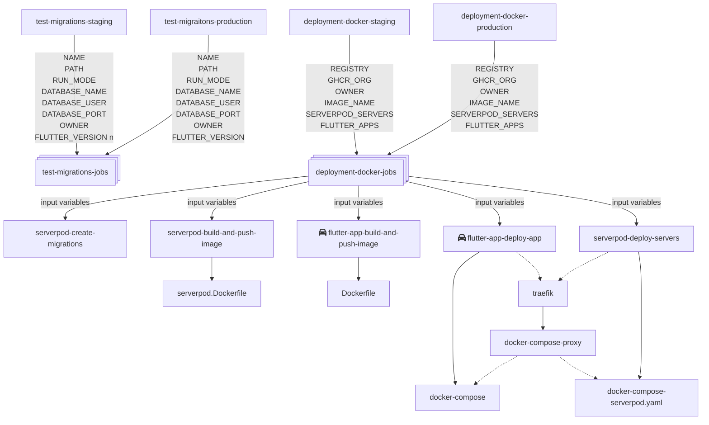

# Setup CI/CD

In this document we are going to set up CI/CD pipeline for a Serverpod project hosted on a simple VPS instance.

## Prerequisites

You should have:

- A VPS instance with Docker installed
- A domain name pointing to your VPS instance
- GitHub repository with GitHub Actions support and sufficient privileges to manipulate those (we are going to be covering this in this documentation)
- GitHub App with content access to all the private repositories that our coe depends on. (we are not going to cover that in this document since we already have that created and should not be touched)

:::warning AVOID POTENTIAL CONFLICTS

To avoid any potential conflicts, the vps should not host any other services except a single instance of **ElbDesk** (`proxy`, `staging` `elbdesk_server`, `production` `elbdesk_server` and `elbdesk_app` wasm/web app containers for a single Serverpod project).
Nothing else, no matter how related to the project, should be hosted on this vps and especialy not multiple different Serverpod projects.

:::

## Introduction

For the purposes of making this documentation generic, we will be using `elbdesk_server` as our project name and `elbdesk.cloud` as our domain name.

After we set up GitHub Actions secrets, in order to configure this pipeline we will be focusing on 3 files and those are: `passwords.yaml`, `deployment-docker-staging.yml` and `deployment-docker-production.yml`.

We are going to be covering how to setup each file specifically so that by the end of this document we have a fully working pipeline that takes advantage of GitHub Actions and Docker containers to build and deploy our docker image as well as running the database migration process all automatically without us needing to give it any special or manual input but a push to a specific branch to test migrations and upon its success to merge the pull request to start the build and deploy process.

This is how our pipeline looks like:



## Server setup

On our VPS / server we need to generate a keypair and add the public key to the authorized_keys file in order to deploy our Serverpod project. We will do that in these two commands on our VPS instance:

1. `ssh-keygen -t rsa -b 4096`
2. `cat ~/.ssh/id_rsa.pub >> ~/.ssh/authorized_keys`

Now we need to copy the private key and have it in the clipboard, we will need it to set up our first secret variable in the next chapter. We are going to do that by running the following command on our VPS:

- _`cat ~/.ssh/id_rsa`_
- Now select the entire output with the mouse and copy it to clipboard.

That is all for our server setup, we won't need to touch it anymore.

## Setting up GitHub secrets

You can navigate to your repository's secrets by going to the following URL [https://github.com/app-ahoi/repository/settings/secrets/actions](https://www.github.com/app-ahoi/repository/settings/secrets/actions) where `<repository>` should be replaced with actual name of the repository in question which in case would be `elbdesk_coe`.

The final result after we are done importing secrets should look like this:


Here we can see a 9 secret variables that we need to create in order to be available for our GitHub actions scrips. So let's dive into them one by one:

- SSH_PRIVATE_KEY - paste the private key we've just copied from our VPS.
- DATABASE_PASSWORD_STAGING - in this secret you should put the database password of your staging environment. You will find that password defined in your `passwords.yaml` file of your Serverpod server project.
- DATABASE_PASSWORD_PRODUCTION - in this secret you should put the database password of your staging environment. You will find that password defined in your `passwords.yaml` file of your Serverpod server project.
- SERVERPOD_PASSWORDS - in this secret simply copy and paste the entire `passwords.yaml` file of your Serverpod project.
- SSH_HOST - here you should define the IP of your VPS server or a domain name which points to it.
- SSH_USER - type the user from your VPS that you want the GitHub action to use for the ssh connection while deploying our project ➝ often `root`
- EMAIL - type the email you are going to be using
- APP_ID - GitHub App ID (See the next step)
- APP_PRIVATE_KEY - GitHub App private key (See the next step)

That's it! We have successfully set up all of our secrets for our staging CI/CD environment.

## Getting the GitHub App ID and PRIVATE_KEY


- Navigate to [https://github.com/organizations/App-Ahoi/settings/apps/elbdesk-bot](https://github.com/organizations/App-Ahoi/settings/apps/elbdesk-bot) (you'll need to verify your identity with a paskey)
- Copy the **App ID** and add it to the repository secret from the previous step.
- Generate a private key and download the pem file
- Copy the contents of the pem file and add it to the **PRIVATE_KEY** repository secret form the previous step.

:::danger

Store the **PEM** file securely in your password manager. Do not loose it or have it as an unencrypted file on your machine. Do not store it on any other cloud service.

:::

## Installing GitHub App into the repository


- Navigate to [ElbDesk Bot GitHub App installation repository access page](https://github.com/apps/elbdesk-bot/installations/58353818)
- Add the ElbDesk instance repository
- Click `Update access`

## Setting up GHCR package access for repository


- Naviate to [AppAhoi organisation private Flutter image settings page](https://github.com/orgs/App-Ahoi/packages/container/flutter/settings)
- In the **Manage Actions access** add your ElbDesk instance repository.

## Setting up docker and compose configuration files

For generating our flutter base image make sure that the following files are in the `elbdesk_coe/.docker` directory:

- [`flutter.Dockerfile`](https://github.com/App-Ahoi/elbdesk_coe/blob/dev/.docker/flutter.Dockerfile)

Simply add the following files to the `elbdesk_coe/servers/elbdesk_server/` directory:

- [`serverpod.Dockerfile`](https://github.com/App-Ahoi/elbdesk_coe/blob/dev/servers/elbdesk_server/serverpod.Dockerfile)
- [`docker-compose-proxy.yaml`](https://github.com/App-Ahoi/elbdesk_coe/blob/dev/servers/elbdesk_server/docker-compose-proxy.yaml)
- [`docker-compose-serverpod.yaml`](https://github.com/App-Ahoi/elbdesk_coe/blob/dev/servers/elbdesk_server/docker-compose-serverpod.yaml)

For our web app simply copy the following files to our `elbdesk_coe/apps/elbdesk_app/` directory:

- [`Dockerfile`](https://github.com/App-Ahoi/elbdesk_coe/blob/dev/apps/elbdesk_app/Dockerfile)
- [`docker-compose.yaml`](https://github.com/App-Ahoi/elbdesk_coe/blob/dev/apps/elbdesk_app/docker-compose.yaml)

## Configuring the staging environment

In your `elbdesk_coe/servers/elbdesk_server/config/staging.yaml` you should copy and paste the following configuration while overwriting the previous contents of the file:

```yaml
# Configuration for the main API server.
apiServer:
  port: 8080
  publicHost: staging.api.<PROJECT_NAME>.elbdesk.cloud
  publicPort: 443
  publicScheme: https

# Configuration for the Insights server.
insightsServer:
  port: 8081
  publicHost: staging.insights.<PROJECT_NAME>.elbdesk.cloud
  publicPort: 443
  publicScheme: https

# Configuration for the web server.
webServer:
  port: 8082
  publicHost: staging.web.<PROJECT_NAME>.elbdesk.cloud
  publicPort: 443
  publicScheme: https

# This is the database setup for your servers. The default for the Google Cloud
# Engine Terraform configuration is to connect on a private IP address.
# If you are connecting on a public IP (e.g. on AWS or Google Cloud Run), you
# connect on the public IP of the database e.g. database-staging.examplepod.com.
database:
  # the name db name is assembled from SERVERPOD_SERVERS[0].NAME 
  # from elbdesk_coe/.github/workflows/deployment-docker-staging.yml
  # then the environment branch name (run mode) and a `-postgres` suffix
  # <SERVERPOD_SERVERS[0].NAME >-<RUN_MODE>-postgres
  host: coe_elbdesk_server-staging-postgres
  port: 5432
  name: coe_staging
  user: postgres_staging
  requireSsl: false

# This is the setup for Redis. The default for the Google Cloud Engine Terraform
# configuration is to connect on a private IP address.
# If you are connecting on a public IP (e.g. on AWS or Google Cloud Run), you
# connect on the public IP of the database e.g. redis-staging.examplepod.com.
redis:
  enabled: false
  host: redis.private-staging.elbdesk.cloud
  port: 6379
```

Replace the `<PROJECT_NAME>` with the project name we've used when creating the dns record (for example staging.api.**coe**.elbdesk.cloud).

That's it! We've set up our Serverpod staging environment and in the next step we are going to compose out entire staging deployment using our easy to use action script!

## Setting up a GitHub migrate, build and deploy action

In previous sections we've created all required configurations in order to automate our build and deployment environment, the only thing left is to automate the run scrips for each and we are going to do that by deploying a GitHub Action that runs the entire workflow for us.

We are going to run the action each time there is a merge on the `staging` branch of our project. This means that we should be mindful about excessive pull requests to the `staging` and their merge order.

:::warning

It would be best for active development to be done on a separate `dev` branch that can be occasionally merged back into `staging` via a pull request.

:::

First we have to copy all the workflow scripts into our `elbdesk_coe/.github/` directory:

- [`deployment-docker-jobs.yml`](https://github.com/App-Ahoi/elbdesk_coe/blob/dev/.github/workflows/deployment-docker-jobs.yml)
- [`serverpod-create-migrations.yml`](https://github.com/App-Ahoi/elbdesk_coe/blob/dev/.github/workflows/serverpod-create-migrations.yml)
- [`serverpod-build-and-push-image.yml`](https://github.com/App-Ahoi/elbdesk_coe/blob/dev/.github/workflows/serverpod-build-and-push-image.yml)
- [`serverpod-deploy-servers.yml`](https://github.com/App-Ahoi/elbdesk_coe/blob/dev/.github/workflows/serverpod-deploy-servers.yml)
- [`flutter.yml`](https://github.com/App-Ahoi/elbdesk_coe/blob/dev/.github/workflows/flutter.yml)
- [`flutter-app-build-and-push-image.yml`](https://github.com/App-Ahoi/elbdesk_coe/blob/dev/.github/workflows/flutter-app-build-and-push-image.yml)
- [`flutter-app-deploy-app.yml`](https://github.com/App-Ahoi/elbdesk_coe/blob/dev/.github/workflows/flutter-app-deploy-app.yml)

:::tip

The files we've just copied are static and should never be touched and configured.

:::

In order for us to configure and trigger a migration, build and deploy process on PR merge to our `staging` environment we need to create a workflow file.
Create a file `elbdesk_coe/.github/workflows/deployment-docker-staging.yml` and copy the following configuration into it:

```yaml
name: Deploy to Staging

on:
  pull_request:
    branches: [staging]
    types: [closed]
  workflow_dispatch:

permissions:
  contents: write
  packages: write

jobs:
  call-deployment-docker-jobs:
    if: github.event.pull_request.merged == true
    uses: ./.github/workflows/deployment-docker-jobs.yml
    with:
      REGISTRY: "ghcr.io"
      GHCR_ORG: "app-ahoi"
      OWNER: "${{ github.repository_owner }}"
      IMAGE_NAME: ${{ github.repository }}
      SERVERPOD_SERVERS: '[
          {
            "NAME": "coe_elbdesk_server",
            "PATH": "servers/elbdesk_server",
            "RUN_MODE": "staging",
            "API_HOST": "staging.api.coe.elbdesk.cloud",
            "INSIGHTS_HOST": "staging.insights.coe.elbdesk.cloud",
            "WEB_HOST": "staging.web.coe.elbdesk.cloud",
            "DATABASE_HOST": "coe_elbdesk_cloud-staging-postgres-1",
            "REDIS_HOST": "redis.private-staging.elbdesk.cloud",
            "DATABASE_NAME": "coe_staging",
            "DATABASE_USER": "postgres_staging",
            "DATABASE_PORT": "5431:5432"
          }
        ]'
      
      FLUTTER_APPS: '[
          {
            "NAME": "coe_elbdesk_app",
            "PATH": "apps/elbdesk",
            "PACKAGES_PATH": "packages",
            "SERVERPOD_CLIENT_PATH": "servers/elbdesk_client",
            "RUN_MODE": "staging",
            "APP_HOST": "staging.coe.elbdesk.cloud",
            "API_HOST": "https://staging.api.coe.elbdesk.cloud/",
            "FLUTTER_VERSION": "3.27.3"
          }
        ]'

    secrets:
      EMAIL: ${{ secrets.EMAIL }}
      DATABASE_PASSWORD: ${{ secrets.DATABASE_PASSWORD_STAGING }}
      SERVERPOD_PASSWORDS: ${{ secrets.SERVERPOD_PASSWORDS }}
      SSH_PRIVATE_KEY: ${{ secrets.SSH_PRIVATE_KEY }}
      SSH_HOST: ${{ secrets.SSH_HOST }}
      SSH_USER: ${{ secrets.SSH_USER }}
      APP_ID: ${{ secrets.APP_ID }}
      APP_PRIVATE_KEY: ${{ secrets.APP_PRIVATE_KEY }}

```

:::warning production environment
branches should be `branches: [main]`

DATABASE_PORT should be `"DATABASE_PORT": "5431:5432"`

APP_HOST should be `"APP_HOST": "<project-name>.elbdesk.cloud"` without run mode environment subdomain

:::

For a different projectname with a different domain name, replace all instances of `coe` with your project's name.

## Testing migrations

First we have to copy all the workflow scripts into our `elbdesk_coe/.github/` directory:

- [`test-migrations-jobs.yml`](https://github.com/App-Ahoi/elbdesk_coe/blob/dev/.github/workflows/test-migrations-jobs.yml)

Next we need to copy the test environment config to `elbdesk_coe/servers/elbdesk_server/config/`

- [`test_migrations.yaml`](https://github.com/App-Ahoi/elbdesk_coe/blob/dev/servers/elbdesk_server/config/test_migrations.yaml)

:::tip

The files we've just copied are static and should never be touched and configured.

:::

Next we need to trigger the action for staging and production environment and we will do that by creating `test-migrations-staging.yml` and `test-migrations-staging.yml` workflow files in `elbdesk_coe/.github/workflows/`

test-migrations-staging.yml:

```yaml
name: Test migrations for coe_elbdesk_cloud Staging

on:
  pull_request:
    branches: [staging]
    types: [opened, synchronize, reopened]

permissions:
  contents: write
  packages: write

jobs:
  test-migrations:
    name: Test migrations for coe_elbdesk_server Staging
    uses: ./.github/workflows/test-migrations-jobs.yml
    with:
      NAME: "coe_elbdesk_server"
      PATH: "servers/elbdesk_server"
      RUN_MODE: "staging"
      DATABASE_NAME: "postgres_test_database"
      DATABASE_USER: "postgres_test_user"
      DATABASE_PORT: "5432:5432"
      OWNER: ${{ github.repository_owner }}
      FLUTTER_VERSION: "3.27.3"
    secrets:
      DATABASE_PASSWORD: ${{ secrets.DATABASE_PASSWORD_STAGING }}
      SERVERPOD_PASSWORDS: ${{ secrets.SERVERPOD_PASSWORDS }}
      APP_ID: ${{ secrets.APP_ID }}
      APP_PRIVATE_KEY: ${{ secrets.APP_PRIVATE_KEY }}
```

test-migrations-production.yml:

```yml
name: Test Migrations for Production

on:
  pull_request:
    branches: [main]
    types: [opened, synchronize, reopened]

permissions:
  contents: write
  packages: write

jobs:
  test-migrations:
  name: Test migrations for coe_elbdesk_server Production
    uses: ./.github/workflows/test-migrations-jobs.yml
    with:
      NAME: "coe_elbdesk_server"
      PATH: "servers/elbdesk_server"
      RUN_MODE: "production"
      DATABASE_NAME: "postgres_test_database"
      DATABASE_USER: "postgres_test_user"
      DATABASE_PORT: "5432:5432"
      OWNER: ${{ github.repository_owner }}
      FLUTTER_VERSION: "3.24.3"
    secrets:
      DATABASE_PASSWORD: ${{ secrets.DATABASE_PASSWORD_PRODUCTION }}
      SERVERPOD_PASSWORDS: ${{ secrets.SERVERPOD_PASSWORDS }}
      APP_ID: ${{ secrets.APP_ID }}
      APP_PRIVATE_KEY: ${{ secrets.APP_PRIVATE_KEY }}
```

## Final

Push all of these changes into the `staging` branch and enjoy the automated build and deployment together with database migration next time you merge you pull request into the `staging` branch! Make sure that the migrations test, that gets triggered when pull request is created, is successful

<center> 🎉 </center>
