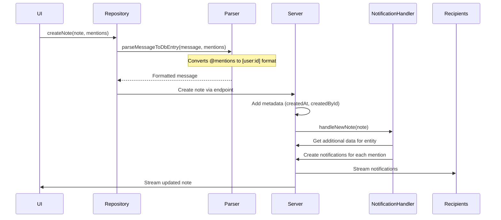

# Entity Notes and Notifications System

## Overview

The Entity Notes and Notifications system in ElbDesk COE provides a comprehensive chat-like commenting feature that can be attached to various entities throughout the application. It includes mentions, threading, real-time updates, and a notification system to keep users informed about relevant discussions.

## Architecture

### Data Models

#### 1. Entity Note (Client & Server)
```dart
// Core fields
- message: String (contains the note text with encoded mentions)
- entity: TableType (the type of entity this note is attached to)
- entityId: int (the ID of the specific entity)
- mentions: List<Mention> (users mentioned in the note)
- parentId: int? (for threading - references parent note)
- hint: String? (additional context information)
- children: List<EntityNote> (client-side only - child notes in threads)

// Metadata
- id: int?
- createdAt: DateTime?
- createdById: int?
- lastModifiedAt: DateTime?
- deletedAt: DateTime? (soft delete)
```

#### 2. Mention
```dart
// Server model (MentionDTO)
- userId: int

// Client model adds:
- start: int? (position in text where mention starts)
- end: int? (position in text where mention ends)
- userName: String? (display name)
```

#### 3. Entity Note Notification
```dart
- entity: TableType
- entityId: int
- label: String (entity-specific label)
- message: String (the note content)
- isUpdate: bool (whether this is an update to existing note)
- createdAt: DateTime
- readAt: DateTime?
- clearedAt: DateTime?
- parentId: int? (for thread notifications)
- additionalData: String? (JSON with entity-specific data)
- senderId: int
- userId: int (recipient)
- noteId: int
```

## Data Flow

### 1. Creating a Note



### 2. Mention System

The mention system works in two phases:

**Input Phase:**
1. User types @ in the input field
2. Autocomplete shows available users
3. Selection creates a Mention object with start/end positions
4. Visual feedback shows mention in blue

**Storage Phase:**
1. Before saving, mentions are encoded: `@John Doe` → `[user:123]`
2. Server stores the encoded format
3. When displaying, `[user:123]` is decoded back to `@John Doe`

### 3. Notification Creation

When a note is created or updated:

1. **Extract Recipients**: All mentioned users become notification recipients
2. **Generate Additional Data**: Entity-specific data is collected (e.g., customer name, sales order ID)
3. **Create Notifications**: One notification per recipient (excluding the sender)
4. **Stream Updates**: Notifications are streamed to online recipients

### 4. Real-time Updates

The system uses Serverpod's streaming capabilities:

```dart
// Server broadcasts changes
entityNoteStreamController.add(insertedNote);
entityNoteNotificationStreamController.add(notification);

// Clients listen to streams
Stream<EntityNoteDTO> watch(entity: TableType, entityId: int)
Stream<EntityNoteNotificationDTO> watch() // filtered by userId
```

## Key Components

### 1. Server-Side

#### EntityNoteEndpoint
- Handles CRUD operations for notes
- Manages real-time streaming
- Enforces permissions (only creators can edit/delete)

#### EntityNoteNotificationHandler
- Processes new and updated notes
- Creates notifications for mentions
- Handles notification updates when notes are edited

#### EntityNoteAdditionalDataHandler
- Generates entity-specific labels and data
- Supports multiple entity types (Contact, SalesOrder, Customer, etc.)
- Provides context for notifications

### 2. Client-Side

#### EntityNoteRepository
- Interface between UI and server
- Handles mention parsing
- Manages note lifecycle

#### WatchNotes Provider
- Maintains note hierarchy (parent-child relationships)
- Handles real-time updates
- Builds threaded conversations

#### EntityNotesView
- Main UI component for displaying notes
- Supports threading with PageView
- Includes input field with mention support

#### Chat Bubble
- Individual note display
- Shows sender, timestamp, message
- Supports editing and deletion (for own notes)
- Thread navigation

### 3. Notification UI

#### EntityNoteNotificationTile
- Polymorphic component that renders based on entity type
- Shows entity-specific information
- Opens relevant window when clicked

#### NotificationOverlayState
- Manages desktop notifications
- Shows toast-style alerts for new messages
- Windows taskbar integration

## Entity-Specific Implementations

The system supports various entity types with custom handling:

1. **Contact**: Shows contact type (Person/Company)
2. **Customer**: Displays customer name
3. **SalesOrder**: Shows order ID and customer
4. **CompanyEmployee**: Shows employee and company names
5. **ArtworkMaster**: Includes artwork ID and sales order reference
6. **ProductMaster**: Shows product ID and sales order
7. **SOI modules**: Various sales order item types with specific data

Each entity type has:
- Custom additional data structure
- Specific window type for navigation
- Tailored notification display

## Features

### 1. Threading
- Notes can have parent-child relationships
- Thread view shows conversation context
- Replies count displayed on parent notes

### 2. Soft Delete
- Notes are marked as deleted (deletedAt timestamp)
- Deleted messages show placeholder text
- Undo available for 2 minutes after deletion

### 3. Edit History
- lastModifiedAt tracks edits
- "Edited" indicator shown for modified notes

### 4. Permissions
- Only note creators can edit/delete their notes
- All users can read notes on entities they have access to

### 5. Real-time Sync
- Changes broadcast to all viewers
- Notifications delivered instantly
- UI updates without refresh

### 6. Rich Text Support
- URL detection and linking
- Mention highlighting
- Preserved formatting

## Best Practices

1. **Always include entity context**: Use the hint field for additional context
2. **Handle streaming errors**: Implement proper error recovery
3. **Optimize mention queries**: Cache user lists for autocomplete
4. **Test entity-specific handlers**: Each entity type needs proper additional data
5. **Consider performance**: Large threads may need pagination

## Future Enhancements

1. **Mention groups**: @all, @team functionality
2. **Rich media**: Image/file attachments
3. **Reactions**: Emoji responses to notes
4. **Search**: Full-text search across notes
5. **Export**: Thread export for documentation
6. **Offline support**: Queue notes for later sync